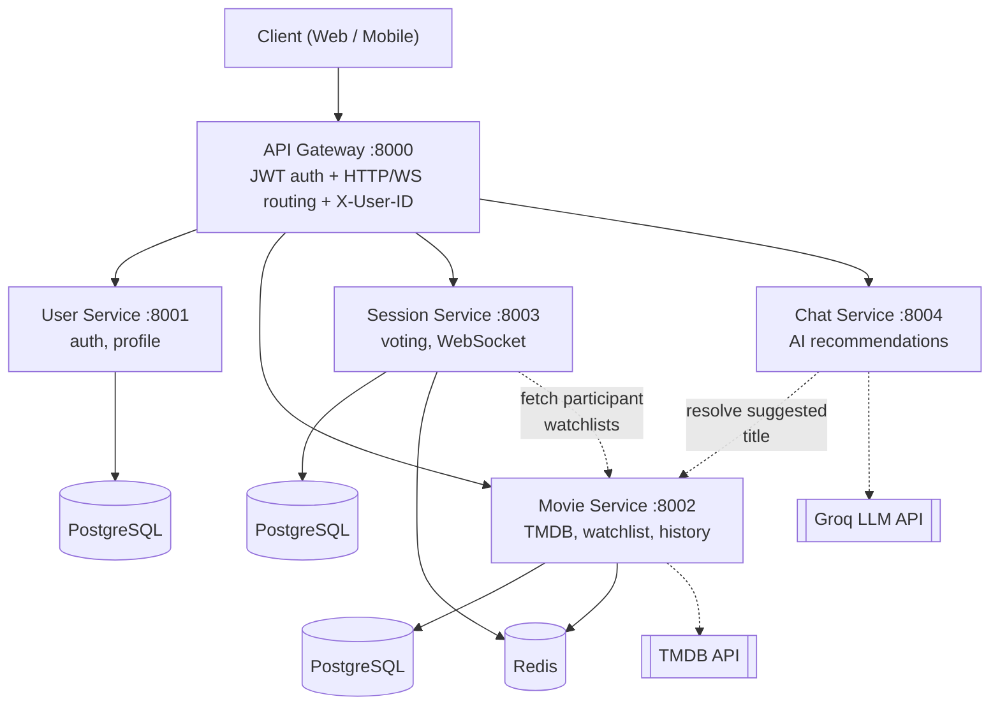

# 🎬 Movie Night

**A microservices-based real-time movie selection platform** that helps groups discover movies, build shared watchlists, and decide what to watch together through synchronized voting.

The project is built with **Django, Django REST Framework, PostgreSQL, Redis, WebSockets, Docker, and an API Gateway**, with an additional AI-powered recommendation service.

<p align="left">
  
  
  
  
  
  
  
  
</p>

## 📑 Table of Contents

- [Why this is more than a CRUD app](#why-this-is-more-than-a-crud-app)
- [Features](#-features)
- [Architecture](#️-architecture)
- [Core Concepts](#-core-concepts)
- [How a Voting Session Works](#️-how-a-voting-session-works)
- [API Reference](#-api-reference)
- [Real-Time Communication](#-real-time-communication)
- [Data Model](#️-data-model)
- [Security & Design Decisions](#-security--design-decisions)
- [Getting Started](#-getting-started)
- [Related Docs](#-related-docs)
- [Author](#-author)

---

## Why this is more than a CRUD app

- **5 independently deployable services**, each owning its own database — no shared tables, no cross-service foreign keys. Communication only happens over internal HTTP calls.
- **A hand-rolled API Gateway**, not a stock reverse proxy: it verifies JWTs, decides which routes need auth, forwards identity downstream via `X-User-ID`, and proxies both regular HTTP **and WebSocket upgrades** to the right service.
- **Real-time state lives in Redis, not memory.** A session's live voting state (per-user movie queues, current index, like counts, cached movie details) is tracked with async `redis.asyncio` calls from Django Channels consumers — so any Session Service instance can serve any active session, and nothing is lost if a client reconnects.
- **A resilient movie catalog** — TMDB data is mirrored locally in Postgres, so previously-seen movies stay resolvable even if TMDB or Redis is temporarily down.
- **An LLM recommendation flow that doesn't trust the model blindly** — the Chat Service takes the LLM's suggested title and re-resolves it through the Movie Service to get real, verified movie data, and fails gracefully with a user-facing message if either dependency is unreachable.
- **Self-documenting API** — the Gateway exposes a generated OpenAPI schema and Swagger UI, so the whole platform's public surface is inspectable from one place.

The most interesting code lives in `Session-Service/groups/consumers.py` (WebSocket session lifecycle) and `Session-Service/groups/services/vote_store.py` (the Redis-backed voting state machine) — worth a look if you're reviewing this as a portfolio piece.

---

## ✨ Features

### 🔐 Authentication & Identity
- Registration and login with email/password
- JWT access + refresh token issuance
- Refresh-token blacklisting on logout (a used/logged-out refresh token can't be replayed)
- Full profile management — view, update, and delete your account (`GET`/`PUT`/`PATCH`/`DELETE`)
- Auth enforced once, centrally, at the API Gateway — downstream services trust the `X-User-ID` header instead of re-validating JWTs themselves

### 🎬 Movie Discovery & Personal Library
- Search movies live via the [TMDB](https://www.themoviedb.org/) API
- Rich movie details: poster, overview, release year, rating
- Similar-movie recommendations per title
- Movies and genres are mirrored locally on first lookup, so they stay resolvable even if TMDB is temporarily unreachable
- Personal watchlist — add/remove movies you plan to watch
- Watched history — mark movies watched and attach your own rating
- TMDB responses cached in Redis for 24 hours to cut down on redundant external calls
- Throttling on the expensive, TMDB-backed endpoints

### 👥 Real-Time Group Voting Sessions
- Create a session and get a unique 6-digit join code
- Join an existing session with that code
- Session-scoped **Leader**/**Member** roles (not account-level roles)
- Leader-only session start, gated on having at least two participants
- Automatic **Pool** building: every participant's watchlist is combined, deduplicated, and independently shuffled per user
- Real-time yes/no voting over WebSocket, broadcast to the whole group as it happens
- Automatic winner selection — unanimous agreement, or highest vote count with a random tiebreaker
- Graceful "no winner" outcome if the pool runs out with no liked movie
- WebSocket reconnection support — a dropped connection can resume without restarting the session
- Session cleanup: all temporary Redis state is deleted once a session ends

### 🤖 AI-Powered Recommendations
- Start a short conversational Q&A about mood and preferences
- Structured, validated answer collection across multiple turns
- Preferences sent to an LLM (via Groq) to generate a suggested title
- The suggested title is **re-resolved through the Movie Service**, not trusted as-is — you get back a real movie record with full details, not raw LLM text
- Graceful failure handling if the LLM or the movie lookup is unavailable

### 🚀 Platform & Infrastructure
- Microservices architecture with independent deployability per service
- Single public entry point via the API Gateway (services are never exposed directly to clients)
- Every service Dockerized with its own `Dockerfile`; orchestrated together via Docker Compose
- Environment-based configuration (`.env` per service, nothing hardcoded)
- Self-documenting API: Swagger UI (`/api/docs`) and raw OpenAPI schema (`/api/schema`) generated via drf-spectacular

---

## 🏗️ Architecture



| Service | Responsibility | Data Store | External Dependency |
|---|---|---|---|
| **API Gateway** | JWT validation, HTTP + WebSocket proxying, `X-User-ID` propagation, centralized OpenAPI docs | — | all internal services |
| **User Service** | Registration, login, refresh, logout (blacklisting), profile CRUD | PostgreSQL | — |
| **Movie Service** | TMDB search/details, local movie mirror, watchlist, watched history | PostgreSQL, Redis | TMDB API |
| **Session Service** | Session lifecycle, real-time WebSocket voting, vote tallying | PostgreSQL, Redis | Movie Service |
| **Chat Service** | Conversational recommendation flow | PostgreSQL | Groq LLM API, Movie Service |

**Core principles:**
- Clients never talk to individual services directly — everything goes through the Gateway.
- Each service owns its own schema; there are no shared tables and no cross-service foreign keys.
- Cross-service calls (e.g. Session Service pulling a user's watchlist from the Movie Service) happen over plain internal HTTP, using the user's identity forwarded as `X-User-ID`.
- Session state is ephemeral and lives entirely in Redis — if it's lost mid-session, the session can't be recovered.

---

## 🧠 Core Concepts

| Term | Definition |
|---|---|
| **Session** | A temporary real-time group activity identified by a 6-digit code. Destroyed once it ends. |
| **Leader** | The user who creates the session. Only the Leader can start it. The session survives if the Leader disconnects mid-session. |
| **Member** | Any user who joins a session (the Leader is also a Member). |
| **Watchlist** | A user's personal list of movies they intend to watch. |
| **Pool** | The deduplicated, shuffled combination of all participants' watchlists — the candidates voted on in a session. |
| **Vote** | A yes/no response from a member on the currently displayed movie. |
| **Selected Movie** | The final outcome — either unanimous agreement, or the highest vote count with a random tiebreaker. |

> 📌 **Leader** and **Member** are roles *scoped to a session*, not account types — any authenticated user can be a Leader in one session and a Member in another.

---

## ⚙️ How a Voting Session Works

1. A user creates a session (`POST /api/sessions`) → becomes **Leader**, receives a unique 6-digit code.
2. Other users **join** using that code (`POST /api/sessions/join`), becoming **Members**.
3. The Leader **starts** the session (`POST /api/sessions/{id}/start`). This requires at least two participants; anyone else attempting to start it is rejected.
4. On start, the **Pool** is built: everyone's watchlists are fetched from the Movie Service, combined, deduplicated, and shuffled independently per participant, then cached in Redis:
   ```text
   session:{session_id}:user:{user_id}:movies   → each user's shuffled candidate list
   session:{session_id}:user:{user_id}:index    → how far that user has voted through their list
   session:{session_id}:movies:likes            → per-movie like counts for the session
   session:{session_id}:movies:details          → cached movie details for fast broadcast
   ```
5. The current movie is broadcast over `ws/sessions/{id}/`. Each participant votes by sending `{"type": "like"}` or `{"type": "dislike"}`.
6. The service advances that user to their next movie and updates Redis counters; once **everyone** finishes their queue (or a timeout elapses), the session evaluates the result.
7. **Outcome:**
   - if a movie got a **yes from everyone** → it becomes the **Selected Movie**, or
   - otherwise, the movie with the **most likes** wins (ties broken randomly), or
   - if nothing was liked at all → the session ends with **no winner**.
8. The result is broadcast to all participants, the session code is invalidated, and its Redis state is deleted.

If a participant's connection drops, they can reconnect and resume without restarting the session.

---

## 📡 API Reference

All routes are relative to the **API Gateway**: `http://localhost:8000/api/...`. 🔒 = requires `Authorization: Bearer <access_token>`. Full interactive docs are served at `GET /api/docs` (Swagger UI) once the Gateway is running, with the raw schema at `GET /api/schema`.

### User Service — `auth`, `profile`
| Method | Path | Description |
|---|---|---|
| POST | `/api/auth/register` | Create an account |
| POST | `/api/auth/login` | Log in, receive access + refresh JWTs |
| POST | `/api/auth/refresh` | Exchange a refresh token for a new access token |
| POST | `/api/auth/logout` | Blacklist a refresh token |
| GET/PUT/PATCH/DELETE 🔒 | `/api/profile` | View, update, or delete your profile |

### Movie Service — `movies`, `watchlist`, `watched` 🔒
| Method | Path | Description |
|---|---|---|
| GET | `/api/movies/search` | Search movies via TMDB |
| GET | `/api/movies/{movie_id}` | Movie details |
| GET | `/api/movies/{movie_id}/recommendations` | Similar-movie recommendations |
| POST/DELETE | `/api/movies/{movie_id}/watchlist` | Add/remove a movie from your watchlist |
| POST/DELETE | `/api/movies/{movie_id}/watched` | Mark a movie watched/unwatched (with rating) |
| GET | `/api/watchlist` | List your watchlist |
| GET | `/api/watched` | List your watched history |

### Session Service — `sessions` 🔒
| Method | Path | Description |
|---|---|---|
| POST | `/api/sessions` | Create a session (you become Leader) |
| POST | `/api/sessions/join` | Join a session by code |
| POST | `/api/sessions/{session_id}/start` | Start voting (Leader only, ≥2 members) |
| POST | `/api/sessions/{session_id}/end` | End the session |
| GET | `/api/sessions/{session_id}` | Session details / members |
| WS | `/ws/sessions/{session_id}/` | Real-time voting channel |

### Chat Service — `recommendations` 🔒
| Method | Path | Description |
|---|---|---|
| POST | `/api/recommendations/start` | Start a recommendation Q&A session |
| POST | `/api/recommendations/{session_id}/answer` | Answer the next question |
| POST | `/api/recommendations/{session_id}/complete` | Get the final, resolved movie suggestion |

---

## ⚡ Real-Time Communication

Real-time group interaction runs on **Django Channels**. Each active session maps to its own WebSocket group, and every connected participant receives events broadcast to that group:

| Event | Fired when |
|---|---|
| `member_joined` | A new participant joins the session |
| `session_started` | The Leader starts voting |
| `movie_liked` | A participant likes the current movie (carries the live like count) |
| `next_movie` | A participant is advanced to their next candidate movie |
| `movie_selected` | A winner is decided (unanimous or highest votes) |
| `no_winner` | The pool is exhausted with no liked movie |
| `session_ended` | The session is closed and its Redis state is cleared |

Before accepting a connection, the consumer validates the session's existence, its current status, that the connecting user is actually a participant, and their identity — all before joining them to the broadcast group.

---

## 🗄️ Data Model

Each service owns its own PostgreSQL schema — no shared tables, no cross-service foreign keys; anything a service needs from another domain is fetched over HTTP:

- **Users** *(User Service)* — central identity entity, holds no role or session-specific attributes.
- **Movies / Genres / MovieGenres** *(Movie Service)* — a local mirror of TMDB data (many-to-many with genres), so previously seen movies stay resolvable even if TMDB is briefly down.
- **Watchlist** *(Movie Service)* — many-to-one from Users → Movies.
- **WatchedHistory** *(Movie Service)* — many-to-one from Users → Movies, with an optional `rating`.
- **Sessions** *(Session Service)* — the durable record of a voting session (code, status, timestamps, `movie_selected_id` once concluded). Live voting state itself stays in Redis for the session's lifetime.
- **SessionParticipants** *(Session Service)* — join table between Sessions and Users, storing each participant's `role` (`leader`/`member`) for that specific session.

---

## 🔐 Security & Design Decisions

- Passwords are stored using a secure one-way hash — never in plaintext.
- Authentication uses JWT access + refresh tokens, issued by the User Service and validated once by the API Gateway on every request — including WebSocket upgrades — so downstream services don't each re-implement token checks.
- Refresh tokens are blacklisted on logout, so a stolen/expired one can't be replayed.
- All endpoints except registration/login require a valid JWT; the Gateway extracts the user id and forwards it downstream as `X-User-ID`, which services trust rather than re-verifying the token themselves.
- Session codes and expensive, TMDB-backed movie endpoints are rate-limited via DRF throttling.

---

## 🚀 Getting Started

### Prerequisites
- [Docker](https://docs.docker.com/get-docker/) and Docker Compose
- A [TMDB API key + read access token](https://www.themoviedb.org/settings/api) (free)
- A [Groq API key](https://console.groq.com/keys) (free tier available)

### 1. Clone the repo
```bash
git clone https://github.com/maZen04/movie-night-microservices.git
cd movie-night-microservices
```

### 2. Configure environment variables
Every service has an `.env.example` — copy each to `.env`:
```bash
cp API-Gateway/.env.example      API-Gateway/.env
cp User-Service/.env.example     User-Service/.env
cp Movie-Service/.env.example    Movie-Service/.env
cp Session-Service/.env.example  Session-Service/.env
cp Chat-Service/.env.example     Chat-Service/.env
```

| Service | Key variables |
|---|---|
| API Gateway | `DJANGO_SECRET_KEY`, `JWT_SECRET_KEY` |
| User Service | `DJANGO_SECRET_KEY`, `JWT_SECRET_KEY`, `DB_PASSWORD` |
| Movie Service | `DJANGO_SECRET_KEY`, `DB_PASSWORD`, `TMDB_API_KEY`, `TMDB_READ_ACCESS_TOKEN` |
| Session Service | `DJANGO_SECRET_KEY`, `DB_PASSWORD` |
| Chat Service | `DJANGO_SECRET_KEY`, `DB_PASSWORD`, `GROQ_API_KEY` |

> ⚠️ `JWT_SECRET_KEY` must be identical in **API Gateway** and **User Service** — the Gateway verifies tokens the User Service issues.
>
> ⚠️ `docker-compose.yml` currently only provisions **Redis**. Each service still expects a PostgreSQL instance reachable via `DB_HOST` / `DB_PASSWORD` — point every `.env` at your own Postgres (local or containerized separately) before bringing the stack up.

### 3. Run the database migrations (per service)
```bash
cd User-Service    && python manage.py migrate && cd ..
cd Movie-Service   && python manage.py migrate && cd ..
cd Session-Service && python manage.py migrate && cd ..
cd Chat-Service    && python manage.py migrate && cd ..
```

### 4. Build and start everything
```bash
docker compose up --build
```

| Service | Port |
|---|---|
| API Gateway | `8000` — the only port meant to be public |
| User Service | `8001` |
| Movie Service | `8002` |
| Session Service | `8003` |
| Chat Service | `8004` |
| Redis | `6379` |

### 5. Try it out
```bash
# Register
curl -X POST http://localhost:8000/api/auth/register \
  -H "Content-Type: application/json" \
  -d '{"email": "you@example.com", "password": "yourpassword", "display_name": "you"}'

# Log in
curl -X POST http://localhost:8000/api/auth/login \
  -H "Content-Type: application/json" \
  -d '{"email": "you@example.com", "password": "yourpassword"}'
```
Use the returned `access` token as a `Bearer` token for all 🔒 routes. Full interactive docs: `http://localhost:8000/api/docs`.

---


## 📄 Related Docs

- [`docs/System Design.pdf`](./docs/System%20Design.pdf) — service boundaries, database schemas, and full API contracts.
- [`docs/Realtime arhc.PNG`](./docs/Realtime%20arhc.PNG) — real-time voting architecture diagram.

---

## 👤 Author

**Mazen Ayman** — Backend developer focused on Python, Django, REST APIs, and distributed backend systems.
[GitHub](https://github.com/maZen04) · [LinkedIn](https://www.linkedin.com/in/mazen-ayman-8409b5356/)

`Microservices` · `Django` · `DRF` · `JWT` · `API Gateway` · `Redis` · `WebSockets` · `Django Channels` · `PostgreSQL` · `Docker` · `TMDB API` · `LLM Integration` · `OpenAPI`
